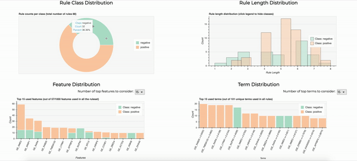
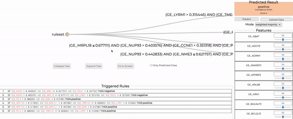
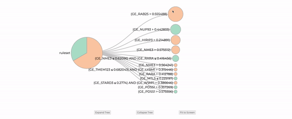

# REMIX: Rule Extraction Methods for Interactive eXplainability
Main repository for work our work with rule extraction methods from Deep Neural
Networks (DNNs). This repository exposes a variety of methods for extracting
rule sets from trained DNNs and a set of visualization tools for inspecting and
using extracted rule sets.

## Credits

A lot of the code in this project is based on the work by Shams et al. made
publicly available at [https://github.com/ZohrehShams/IntegrativeRuleExtractionMethodology](https://github.com/ZohrehShams/IntegrativeRuleExtractionMethodology)
as part of their publication ["REM: An Integrative Rule Extraction Methodology
for Explainable Data Analysis in Healthcare"](https://www.biorxiv.org/content/10.1101/2021.01.22.427799v2.abstract).

Furthermore, this project has been build extensively on top of code open-sourced
by [Flexx](https://github.com/flexxui/flexx).


## Setup
In order to install this library,  you will need the following requirements
first:
- `python` 3.5 – 3.8
- `pip` 19.0 or later
- `R 4.*` needs to be installed and accessible in your machine. This is required
- as we use R's implementation of C5.0 with a `rpy2` wrapper.

Once you have installed R, you will also need to have the following packages
installed in R:
- `C50`
- `Cubist`
- `reshape2`
- `plyr`
- `Rcpp`
- `stringr`
- `stringi`
- `magrittr`
- `partykit`
- `Formula`
- `libcoin`
- `mvtnorm`
- `inum`

If you have all of these, then you can install our code as a Python package
using pip as follows:
```python
python setup.py install --user
```

This will install all required the dependencies for you as well as the entire
project. Please note that this may take some time if you are missing some of the
heavy dependencies we require (e.g TensorFlow).

**Important Note**: depending on your `python` distribution and environment
(specially if you are using `pyenv` or a virtual environment), you may have to
add `--prefix=` (nothing after the equality) to get this installation to work
for you.

## Supported Rule Extraction Methods
Currently, we support the following algorithms for extracting rule sets from
DNNs:
1. [DeepRED](https://link.springer.com/chapter/10.1007/978-3-319-46307-0_29) (Zilke et al. 2016): We support a variation of the DeepRED algorithm in which we use C5.0 rather than C4.5 for intermediate rule extraction. This results in generally better and smaller rule sets than those extracted by the original DeepRED algorithm.
2. [REM-D](https://www.biorxiv.org/content/10.1101/2021.01.22.427799v2.abstract) (Shams et al. 2020): This implementation is based on the original REM-D implementation by Shams et al. but includes several optimizations including multi-threading.
3. ECLAIRE (Zarlenga et al. 2021, work under review): Efficient CLAuse-wIse Rule Extraction allows you to extract rules from a DNN in a much more scalable way than REM-D/DeepRED while generally producing better performing and smaller rule sets. If working with large models or training sets, we strongly recommend using this method over REM-D or DeepRED as otherwise you may be prone to getting intractable runtimes in complex models.
4. PedC5.0 (Kola et al. 2020, University of Cambridge Part II Dissertation): Simple pedagogical rule extraction method in which C5.0 is used to approximate the output of a DNN using its input features.
5. [REM-T](https://www.biorxiv.org/content/10.1101/2021.01.22.427799v2.abstract) (Shams et al. 2020): This method allows you to extract rule sets from random forests or plain decision trees trained on a given task. As opposed to all other methods, this algorithm does not require a DNN and instead requires true labels for its training samples.


## Extracting Rules from Models

You can use a series of rule extraction algorithms with any custom Keras model
trained on a **classification** task. To do this, you can import the following
method once you have installed this package as instructed in the setup:

```python
from remix import eclaire # Or rem_d, pedagogical, rem_t, deep_red_c5
# Read data from some source
X_train, y_train = ...
# Train a Keras model on this data
keras_model = ...

# Extract rules from that trained model
ruleset = eclaire.extract_rules(keras_model, X_train)
# And try and make predictions using this ruleset
X_test = ...
y_pred = ruleset.predict(X_test)

# Or you can also obtain an explanation from a prediction
# Where `explanations` is a list of activated rules for each sample and
# `scores` is a vector containing their corresponding aggregated scores.
y_pred, explanations, scores = ruleset.predict_and_explain(X_test)

# You can also see the learned ruleset by printing it
print(ruleset)
```
All of the methods we support have the same signature where the first argument
must be a trained Keras Model object and the second argument must be a 2D
np.ndarray with shape `[N, F]` containing `N` training samples such that each
sample has `F` features in it. Note that most of these methods are able to take
a variety of hyper-parameters (e.g., the number of minimum samples required for
making a new split in a decision tree can be passed via the `min_cases`
arguments or the number of threads to use `num_workers`). For a full list of the
hyper-parameters supported for a specific method, together with their semantics,
please refer to that method's own documentation in [remix/extract_rules](remix/extract_rules).

## Visualizing Rule Sets

You can visualize, inspect, and make predictions with an extracted rule set
using `remix`, our interactive visualization and inspection tool (NOTE: you need
to be connected to the internet for this to work correctly). To do this, you
will need to first serialize the rule set into a file which can be loaded into
`remix`. You can do this by using
```python
ruleset.to_file("path_to_file.rules")
```
where a serialization path is provided. Note that by convention we use the
`.rules` extension to serialize rule set files.

Once a file has been serialized, you can use `remix` by calling:
```bash
python visualize.py <path_to_file.rules>
```
and this will open up a new window in your default browser. This visualization
tool includes 4 main windows as described below.

### Cohort Analysis Window



The cohort-wide analysis window provides a global view of the rule set in the
form of 4 main plots:
1. A doughnut plot showing how many rules are used for each class in this rule set. This gives you an insight as to weather one class required more rules to be able to be identified than other classes. If you **hover** on top of a wedge of this plot you can get precise numbers of the number of rules for each class.
2. A bar plot showing the rule length distribution across all rule sets. You can toggle between the distributions of specific classes by **clicking** on a class' color in the plot's legend.
3. A bar plot showing how much a given feature is used across multiple rules in the rule set. These are sorted so that most used features are shown in the left. Note that each bar is split by taking into account the class that a rule using that feature predicts. To show more or less features, you can use the combo box on top of this plot to change how many features are displayed. To see specific counts, you can **hover** on top of any of the bars.
4. A bar plot showing how many unique terms are used in total across the entire rule set where each bar is further partitioned into separate classes. As in the feature plot, you can control how many terms are shown in the plot by changing this in the combo box on top of the plot. You can also see specific numbers for each feature by **hovering** on top of each bar.

Note that all of these plots are color-coded so that each possible output conclusion class in the input rule set is assigned one color.

### Prediction Window



This window will allow you to make new predictions by manually providing
features of the sample you are trying to produce or by uploading a CVS file with
the sample in it. Each prediction is further supported using two different
views:
1. A visual tree representation of all the rules that got triggered by the sample where each intermediate note represents a term and each terminal node represents a specific rule's conclusion. In order to highlight connections across multiple rules, this graph is constructed in a greedy manner where we try and group terms that are more common in activated rules first.
2. A text representation where all the activated rules and their conclusions are explicitly shown.

Note that you can change how the prediction is done if you wish to use something else than majority class (e.g., highest confidence rule only). 

### Rule Explorer



This tree visualization offers a complete view of the rule set that was loaded
into REMIX. As in the prediction window, this visualization of the entire rule
set groups terms in a greedy fashion to construct an n-ary tree where each rule
maps to a full root-to-leaf path. Note that each intermediate node also contains
a pie chart that shows the distribution of rules beneath that node. If you hover
on top of each node, further information about it will be provided.

The colors used for each class follow the same color-coding as done in the other
windows.

### Rule Editor


The rule editor allows you to delete rules in the rule set that was loaded while
also giving you an explicit text view of every rule in this rule set.


## Running Experiments
For our experiments we will use the data located in
https://github.com/sumaiyah/DNN-RE-data and you can find all our code in the
`experiments/` directory of this repository. You can run recreate several of our
cross-validation experiments using the provided executable `run_experiment.py`
which offers the following options:
```bash
$python run_experiment.py --help
usage: run_experiment.py [-h] [--config file.yaml] [--n_folds N]
                         [--dataset_name name] [--dataset_file data.cvs]
                         [--rule_extractor name] [--grid_search]
                         [--output_dir path] [--randomize]
                         [--force_rerun {all,data_split,fold_split,grid_search,nn_train,rule_extraction}]
                         [--profile] [-d]
                         [-p param_name=value param_name=value]

Runs cross validation experiment with the given rule extraction method and our neural network training.

optional arguments:
  -h, --help            show this help message and exit
  --config file.yaml, -c file.yaml
                        initial configuration YAML file for our experiment's
                        setup.
  --n_folds N, -n N     how many folds to use for our data partitioning.
  --dataset_name name   name of the dataset to be used for training.
  --dataset_file data.cvs
                        comma-separated-valued file containing our training
                        data.
  --rule_extractor name
                        name of the extraction algorithm to be used to
                        generate our rule set.
  --grid_search         whether we want to do a grid search over our model's
                        hyperparameters. If the results of a previous grid
                        search are found in the provided output directory,
                        then we will use those rather than starting a grid
                        search from scratch. This means that turning this flag
                        on will overwrite any hyperparameters you provide as
                        part of your configuration (if any).
  --output_dir path, -o path
                        directory where we will dump our experiment's results.
                        If not given, then we will use the same directory as
                        our dataset.
  --randomize, -r       If set, then the random seeds used in our execution
                        will not be fixed and the experiment will be
                        randomized. By default, otherwise, all experiments are
                        run with the same seed for reproducibility.
  --force_rerun {all,data_split,fold_split,grid_search,nn_train,rule_extraction}, -f {all,data_split,fold_split,grid_search,nn_train,rule_extraction}
                        If set and we are given as output directory the
                        directory of a previous run, then we will overwrite
                        any previous work starting from the provided stage
                        (and all subsequent stages of the experiment) and redo
                        all computations. Otherwise, we will attempt to use as
                        much as we can from the previous run.
  --profile             prints out profiling statistics of the rule-extraction
                        in terms of low-level calls used for the extraction
                        method.
  -d, --debug           starts debug mode in our program.
  -p param_name=value param_name=value, --param param_name=value param_name=value
                        Allows the passing of a config param that will
                        overwrite anything passed as part of the config file
                        itself.
```

One can run the tool by manually inputing the dataset information as command-line arguments or by providing a YAML config containing the experiment parameterization as the following example:
```yaml
# The directory of our training data. Can be a path relative to the caller or
# an absolute path.
dataset_file: "datasets/XOR/data.csv"

# The name of our dataset. Must be one of the data sets supported by our
# experiment runners.
dataset_name: 'XOR'

# Whether or not we want our experiment runner to overwrite results from
# previous runs found in the given output directory or we want to reuse them
# instead.
# If not provided, or set to null, then we will NOT overwrite any
# previous results and use them as checkpoints to avoid double work in this
# experiment.
# Otherwise, it must be one of
#    - "all"
#    - "data_split"
#    - "fold_split"
#    - "grid_search"
#    - "nn_train"
#    - "rule_extraction"
# to indicate the stage in which we will start rewriting previous results. If
# such a specific stage is provided, then all subsequent stages will be also
# overwritten (following the same order as the list above)
force_rerun: null

# Number of split folds for our training. If not provided, then it will default
# to a single fold.
n_folds: 5

# Our neural network training hyper-parameters
hyperparameters:
    # The batch size we will use for training.
    batch_size: 16
    # Number of epochs to run our model for
    epochs: 150
    # Now many hidden layers we will use and how many activations in each
    layer_units: [64, 32, 16]
    # The activation use in between hidden layers. Can be any valid Keras
    # activation function. If not provided, it defaults to "tanh"
    activation: "tanh"
    # The last activation used in our model. Used to define the type of
    # categorical loss we will use. If not provided, it defaults to the
    # corresponding last activation for the given loss function.
    last_activation: "softmax"
    # The type of loss we will use. Must be one of
    # ["softmax_xentr", "sigmoid_xentr"]. If not provided, we will use the
    # given last layer's activation to obtain the corresponding loss if it was
    # provided. Otherwise, we will default to softmax xentropy.
    loss_function: "softmax_xentr"
    # The learning rate we will use for our Adam optimizer. If not provided,
    # then it will be defaulted to 0.001
    learning_rate: 0.001
    # Dropout rate to use in layer in between last hidden layer and last layer
    # If 0, then no dropout is done. This is the probability that a given
    # activation will be dropped.
    dropout_rate: 0
    # Frequency of skip connections in the form of additions. If zero, then
    # no skip connections are made
    skip_freq: 0


    ###########################################
    # Early Stopping Parameters
    ###########################################

    # Early stopping parameters. Only valid if patience is greater than 0.
    early_stopping_params:
        validation_percent: 0.1
        patience: 0
        monitor: "loss"
        min_delta: 0.001
        mode: 'min'

    # Optimizer parameters
    optimizer_params:
        decay_rate: 1
        decay_steps: 1

# How many subprocesses to use to evaluate our ruleset in the testing data
evaluate_num_workers: 6

# The rule extractor we will use. If not provided, it defaults to ECLAIRE.
# Must be one of [
#   "REM-D",
#   "ECLAIRE", (or equivalently "eREM-D")
#   "cREM-D",
#   "Pedagogical",
#   "Clause-REM-D",
#   "DeepRED",
#   "REM-T",
#   "sREM-D"
# ]
rule_extractor: "ECLAIRE"

# And any parameters we want to provide to the extractor for further
# tuning/experimentation. This is dependent on the used extractor
extractor_params:
    # An integer indicating how many decimals should we truncate our thresholds
    # to. If null, then no truncation will happen.
    # For original REM-D: set to null
    threshold_decimals: null

    # The winnow parameter to use for C5 for intermediate rulesets.
    # Must be a boolean.
    # For original REM-D: set to True
    winnow_intermediate: True

    # The winnow parameter to use for C5 for the last ruleset generation (which
    # depends on the actual features)
    # Must be a boolean.
    # For original REM-D: set to True
    winnow_features: True

    # The minimum number of cases for a split in C5. Must be a positive integer
    min_cases: 2

    # What is the maximum number of training samples to use when building trees
    # If a float, then this is seen as a fraction of the dataset
    # If 0 or null, then no restriction is applied.
    # For original REM-D: set to null
    max_number_of_samples: null

    ###########################################
    # REM-T Parameters
    ###########################################

    # The name of the algorithm used to extract the decision trees if using
    # REM-T
    # Must be one of: [C5.0, random_forest, cart]
    tree_extraction_algorithm_name: "C5.0"

    # Whether or not we perform posthoc CCP pruning when growing decision trees
    ccp_prune: true

    # Number of estimators to use in random forest if using REM-T
    estimators: 10

    # The maximum depth allowed for a single tree when using REM-T with
    # CART and/or random_forest
    tree_max_depth: 10

    ###########################################
    # ECLAIRE Parameters
    ###########################################

    # The rule extraction algorithm used to change intermediate rule sets in
    # ECLAIRE to be a function of input feature activations only.
    # Must be one of ["C5.0", "CART", "random_forest"]
    # If not given then C5.0 is used
    final_algorithm_name: "C5.0"

    # The rule extraction algorithm used to generate intermediate rule sets in
    # ECLAIRE.
    # Must be one of ["C5.0", "CART", "random_forest"]
    # If not given then C5.0 is used
    intermediate_algorithm_name: "C5.0"

    # The number of processes (i.e. workers) to use when extracting rules from
    # our ruleset. Make sure to pick a reasonable number depending on the number
    # of cores you have
    # For original REM-D: set to 1
    num_workers: 6

    # Number of blocks to partition our network in when performing intermediate
    # rule extraction
    # For original REM-D: set to 1
    block_size: 1

    # Bagging trials for reducing the variance in our ruleset generation
    # Must be an integer greater than or equal to 1
    # For original REM-D: set to 1
    trials: 1

    # Whether or not we preemptively remove redundant clauses
    # For original REM-D: set to False
    preemptive_redundant_removal: False

    # Fraction of lowest-activating activations we will drop when building up
    # our predictors using an intermediate layer's activations
    # For original REM-D: set to 1
    top_k_activations: 1

    # What percent of intermediate rules we will drop using our the given
    # ranking mechanism
    # For original REM-D: set to 0
    intermediate_drop_percent: 0

    # We can anneal the dropping rate so that later layers drop less terms than
    # those in the start. We do this using a linear schedule starting with
    # initial_drop_percent and ending with intermediate_drop_percent
    # If null and intermediate_drop_percent is greater than zero, then we will
    # set this to intermediate_drop_percent as well.
    # For original REM-D: set to null
    initial_drop_percent: null

    # Rule scoring mechanism to be used for dropping intermediate ruleset
    # activations. Only relevant if intermediate_drop_percent is greater than
    # zero.
    # Has to be one of ["Majority", "Accuracy", "HillClimb", "Confidence"]
    rule_score_mechanism: "Confidence"

    # Whether or not when we iterate over terms, we merge their negations into
    # the set of terms to avoid extracting them twice
    # For original REM-D: set to False
    merge_repeated_terms: True

    # Minimum confidence required for a given rule to be included in the
    # a produced ruleset
    # For original REM-D: set to 0
    min_confidence: 0

    # Maximum number of rules allowed in any intermediate ruleset generated
    # by the decompositional algorithm. If ruleset has more rules than this
    # number, then we will drop the lowest ranking rules until we have a rule
    # set as with exactly max_intermediate_rules
    # If null, then no rule pruning happens
    max_intermediate_rules: null

    # Whether or not intermediate rule elimination happens at a per-class basis
    # or not.
    per_class_elimination: true

    # The initial value of min cases to for later layers in the network.
    # If 0 or null, then we will use the same as min_cases throughout.
    # Otherwise we will do a linear interpolation where the end number of min
    # cases is given by min_cases
    # For original REM-D: set to null
    initial_min_cases: null

    # The number of min cases used at the end of processing all intermediate
    # layers (if annealing is done).
    # If null or 0 then we will use the same value as min_cases
    intermediate_end_min_cases: null

    # Whether or not we will use class weights in C5.0 when changing variables
    # in intermediate rule sets
    balance_classes: false

    # Maximum depth of tree in rule extractor used to generate intermediate rule
    # sets if CART and/or random_forest is used.
    intermediate_tree_max_depth: 15

    # Maximum depth of tree used to change variables in intermediate rule sets
    # if CART and/or random_forest is used.
    final_tree_max_depth: 10

    # If True, then ECLAIRE will include input feature activations as part of
    # the set of activations it can use to extract intermediate rule sets from.
    ecclectic: False


# We can specify which mechanism we will obtain a score a given rule given our
# training data and its class. When classifying a new point, we will assign
# scores to every rule and then pick the class corresponding to the ruleset with
# the highest average score for all triggered rules of that set. We currently
# support the following scoring functions:
#   - "Majority": Rule majority voting will be done to determine the output
#                 class. This means every rule has a score of 1.
#   - "Accuracy": accuracy of each rule in the training set will be used to
#                 score each rule.
#   - "HillClimb": HillClimb scoring function based on the training set will be
#                  used to score each rule.
#   - "Confidence": the confidence level of each rule when generating the
#                   ruleset will be used as its score function.
# If not given, we will default to "Majority".
rule_score_mechanism: "Majority"

# If we wan to drop the lowest `percent` rules after scoring, then you can do
# so by modifying this argument here which will drop them after scoring and
# before evaluation. This must be a real number in [0, 1]
rule_elimination_percent: 0

# Where are we dumping our results. If not provided, it will default to the same
# directory as the one containing the dataset.
output_dir: "experiment_results"

# Parameters to be used during our grid search
grid_search_params:
    # Whether or not to perform grid-search
    enable: False
    # The metric we will optimize over during our grid-search. Must be one of
    # ["accuracy", "auc"]
    metric_name: "accuracy"
    # Batch sizes to be used during training
    batch_sizes: [16, 32]
    # Training epochs to use for our DNNs
    epochs: [50, 100, 150]
    # Learning rates to try in our optimizer
    learning_rates: [0.001, 0.0001]
    # The sizes to try for each hidden layer
    layer_sizes: [[128, 64, 32], [64, 32]]
    # Activations to use between hidden layers. Must be valid Keras activations
    activations: ["tanh", "elu"]
    # The amount of dropout to use between hidden layers and the last layer
    dropout_rates: [0, 0.2]
    # Finally, the loss function to use for training
    loss_functions: ["softmax_xentr", "sigmoid_xentr"]

```

In this example, we are indicating the path where we are we storing our
`XOR` dataset and what hyper-parameters we want to use for our neural network.

You can then use this to run the experiment as follows:
```bash
python run_experiment.py --config experiment_config.yaml
```

If run successfully, then you should see an output similar to this one:
```bash
$ python run_experiment.py --config experiment_configs/xor/eclaire_best_config.yaml
Starting experiment with data being dumped at experiment_results
Test accuracy for fold 1/5 is 0.98, AUC is 0.979, and majority class accuracy is 0.607                                                                                                                          
Test accuracy for fold 2/5 is 0.935, AUC is 0.935, and majority class accuracy is 0.598                                                                                                                         
Test accuracy for fold 3/5 is 0.985, AUC is 0.986, and majority class accuracy is 0.576                                                                                                                         
Test accuracy for fold 4/5 is 0.955, AUC is 0.955, and majority class accuracy is 0.58                                                                                                                          
Test accuracy for fold 5/5 is 0.975, AUC is 0.973, and majority class accuracy is 0.567                                                                                                                         
Training fold model 5/5: 100%|████████████████████████████████████████████████████████████████████████████████████████████████████████████████████████████████████████████████████| 5/5 [00:43<00:00,  8.65s/it]
Done extracting intermediate rulesets: 100%|██████████████████████████████████████████████████████████████████████████████████████████████████████████████████████████████████████| 3/3 [00:01<00:00,  1.92it/s]
Substituting rules for layer 3: 100%|█████████████████████████████████████████████████████████████████████████████████████████████████████████████████████████████████████████████| 3/3 [00:02<00:00,  1.12it/s]
[INFO] Performing prediction over 200 test samples using 79 rules and 1 effective processes.
[INFO] Rule set test accuracy for fold 1/5 is 0.875, AUC is 0.87, fidelity is 0.875, and size of rule set is 79
Done extracting intermediate rulesets: 100%|██████████████████████████████████████████████████████████████████████████████████████████████████████████████████████████████████████| 3/3 [00:00<00:00,  3.18it/s]
Substituting rules for layer 3: 100%|█████████████████████████████████████████████████████████████████████████████████████████████████████████████████████████████████████████████| 3/3 [00:02<00:00,  1.22it/s]
[INFO] Performing prediction over 200 test samples using 76 rules and 1 effective processes.
[INFO] Rule set test accuracy for fold 2/5 is 0.93, AUC is 0.928, fidelity is 0.925, and size of rule set is 76
Done extracting intermediate rulesets: 100%|██████████████████████████████████████████████████████████████████████████████████████████████████████████████████████████████████████| 3/3 [00:00<00:00,  3.18it/s]
Substituting rules for layer 3: 100%|█████████████████████████████████████████████████████████████████████████████████████████████████████████████████████████████████████████████| 3/3 [00:02<00:00,  1.12it/s]
[INFO] Performing prediction over 200 test samples using 77 rules and 1 effective processes.
[INFO] Rule set test accuracy for fold 3/5 is 0.955, AUC is 0.953, fidelity is 0.94, and size of rule set is 77
Done extracting intermediate rulesets: 100%|██████████████████████████████████████████████████████████████████████████████████████████████████████████████████████████████████████| 3/3 [00:01<00:00,  2.61it/s]
Substituting rules for layer 3: 100%|█████████████████████████████████████████████████████████████████████████████████████████████████████████████████████████████████████████████| 3/3 [00:03<00:00,  1.07s/it]
[INFO] Performing prediction over 200 test samples using 119 rules and 1 effective processes.
[INFO] Rule set test accuracy for fold 4/5 is 0.915, AUC is 0.911, fidelity is 0.9, and size of rule set is 119
Done extracting intermediate rulesets: 100%|██████████████████████████████████████████████████████████████████████████████████████████████████████████████████████████████████████| 3/3 [00:01<00:00,  2.39it/s]
Substituting rules for layer 3: 100%|█████████████████████████████████████████████████████████████████████████████████████████████████████████████████████████████████████████████| 3/3 [00:02<00:00,  1.08it/s]
[INFO] Performing prediction over 200 test samples using 84 rules and 1 effective processes.
[INFO] Rule set test accuracy for fold 5/5 is 0.915, AUC is 0.91, fidelity is 0.93, and size of rule set is 84
+------+---------------+---------------+------------------+---------------+------------------+-----------------------+------------------------+---------------+---------------------+----------------+
| Fold |  NN Accuracy  |     NN AUC    | ECLAIRE Accuracy |  ECLAIRE AUC  | ECLAIRE Fidelity | Extraction Time (sec) | Extraction Memory (MB) |  Ruleset Size | Average Rule Length |   # of Terms   |
+------+---------------+---------------+------------------+---------------+------------------+-----------------------+------------------------+---------------+---------------------+----------------+
|  1   |      0.98     |     0.979     |      0.875       |      0.87     |      0.875       |         4.468         |        914.341         |       79      |        3.063        |      174       |
|  2   |     0.935     |     0.935     |       0.93       |     0.928     |      0.925       |          3.65         |        704.218         |       76      |         3.0         |      146       |
|  3   |     0.985     |     0.986     |      0.955       |     0.953     |       0.94       |         3.847         |        419.655         |       77      |        2.766        |      152       |
|  4   |     0.955     |     0.955     |      0.915       |     0.911     |       0.9        |         4.559         |        325.878         |      119      |        3.445        |      268       |
|  5   |     0.975     |     0.973     |      0.915       |      0.91     |       0.93       |         4.273         |        716.786         |       84      |        2.893        |      178       |
| avg  | 0.966 ± 0.019 | 0.966 ± 0.018 |  0.918 ± 0.026   | 0.914 ± 0.027 |  0.914 ± 0.024   |     4.159 ± 0.354     |   616.176 ± 214.322    | 87.0 ± 16.236 |    3.033 ± 0.229    | 183.6 ± 43.953 |
+------+---------------+---------------+------------------+---------------+------------------+-----------------------+------------------------+---------------+---------------------+----------------+
~~~~~~~~~~~~~~~~~~~~ Experiment successfully terminated after 71.181 seconds ~~~~~~~~~~~~~~~~~~~~
```

The default cross-validation experiment will do the following:
  1. Split our dataset into training/test datasets and further split our training data into the number of requested folds.
  2. Train one neural network for each fold of data.
  3. Extract rules for each neural network we trained.
  4. Compare the performance of the neural network and the extracted ruleset in our test data.
  5. Dump all the results, statistics, and details of the experiment in the provided directory following the file hierarchy described below.

If the output directory exists and contains data from a previous run, our runner
will attempt to reuse it as much as possible to avoid recomputing things. If you
do not want that behavior, please make sure to use different directories for
different runs or call the script with the `-f` flag in it.

Please note that if a configuration file is provided and command-line arguments
are also provided, then the ones given in the command-line will always take
precedence over their counterparts in the config file. The intent of this
behavior is to speed up different iterations in experiments.

### Experiment Folder structure
Once an experiment is instantiated, we will generate a file structure containing
all the results of the experiment as follows:
```markdown
`<output-dir>`
    `cross_validation/` - contains data from cross-validated rule_extraction

    ​   `<n>_folds/` - contains data from e.g. 10_folds/

    ​       `rule_extraction/`

    ​           `<rule_ex_mode>/` - e.g. eclaire, pedagogical, rem-d

    ​               `results.csv` - results for rule extraction using that mode

    ​               `rules_extracted/` - saving the rules extracted to disk

    ​                   `fold_<n>.rules` - Pickle object of our rule set
                       `file_<n>.rules.txt` - Human-readable version of the rules.

    ​       `trained_models/` - trained neural network models for each fold

    ​           `fold_<n>_model.h5`

    ​       `data_split_indices.txt` - indices for n stratified folds of the data

    `grid_search_results.txt` - results from neural network hyper-parameter grid search

    `data_split_indices.txt` - indices of data split for train and test data

    `config.yaml` - copy of the configuration file used for this experiment for recreation purposes
```
At the end of the experiment, you should expect to find this file structure in
the provided results output directory.

If no output directory is provided, then we will use the same directory as the
one containing our dataset.

## Recreating Results

To recreate any of the results reported this dissertation, you can call
```bash
python run_experiment.py --config experiment_configs/<dataset_name>/<method_name>_best_config.yaml
```
from the `experiments/` directory and that should generate the results reported
in our paper (up to possible some small marginal differences due to
non-determinism).

## Tests
We have also included a simple test that verifies the basic functionality of all
the main tools and methods we introduce in this codebase. This testing suite is
no way comprehensive but it helps making sure the main pathways are at least
exercised and working. To run these tests, you need to run `pytest` as:

```bash
pytest tests/test_rule_extractors.py -s
```
